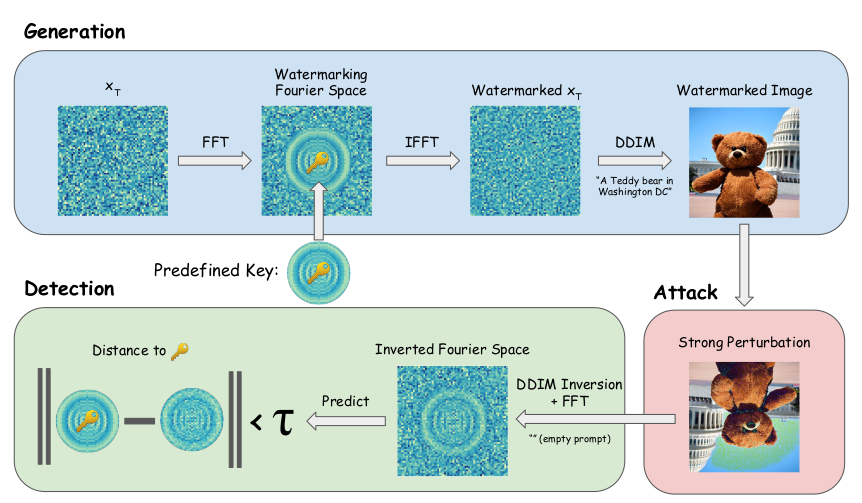

---
{
  "title": "Tree-Ring Watermarks: Fingerprints for Diffusion Images that are Invisible and Robust",
  "paper": "https://arxiv.org/abs/2305.20030",
  "authors": "Yuxin Wen, John Kirchenbauer, Jonas Geiping, Tom Goldstein",
  "code": "https://github.com/YuxinWenRick/tree-ring-watermark",
  "annotated": null,
  "date": "5th January, 2024"
}
---

### motivation

Over the last few years, there has been a lot of ongoing research around models that can generate images from textual descriptions. At first, models did not do so well and were only good enough when specialized to a certain task - expression swap, style transfer, deepfake/identity synthesis, etc. With the introduction of [Generative Adversarial Networks][] (GANs), the quality of image synthesis improved greatly and had a widespread impact in the field. Research around generative image models with high quality/fidelity and control boomed even more after the introduction of the novel [self-attention][] mechanism and vision transformers. Things took an even better turn with the introduction of [diffusion models for image generation][], which led to the birth of [Stable Diffusion][] and accompanying models/techniques. With SD, and it's later introduced improved version SDXL, generation of extremely high quality images with improved control was made possible on consumer-grade hardware! Anyone can generate images of any style, inpaint defected parts of an image, perform super resolution to create higher resolution and pixel-perfect images, do image colourization, etc. - all in near real-time with some of the latest ideas and research.

With the amazing improvements, in image and video generation capabilities of diffusion models, came a new set of challenges. Many services and API platforms were developed that allowed the generation of images of any kind, including but not limited to topics around realistic images of people, violence, pornography, racial discrimination, deep fakes, bias, etc. The impact of this on real-life issues is vast and this is unethical use of research (meant towards pushing the boundaries of existing limitations and achieving general intelligence through computing systems). This calls for the need to use digital watermarking techniques that allow for the generation of real vs. fake/AI-generated content.

### highlights

- Most existing methods perform watermarking post sampling. Post sampling watermarking can include performing visible and/or invisible watermarking such as adding a signature/logo, metadata, steganography, etc.
- Tree-ring watermarking influences entire sampling process by embedding an initial noise vector to the noisy/random latents which will be used for sampling.
- Noise embeddings are performed in [fourier space][] and so they are invariant to convolutions, crops, dilations, flips and rotations. ([my thoughts](#1))
- Negligible loss in [FID][], which is great because one can perform watermarking with negligible loss in quality.
- Easily applicable to arbitrary diffusion models. [my thoughts](#2)
- Claims to be far more robust against adversarial attacks than any other currently deployed method.
- Does not require additional training or finetuning of existing diffusion model it is employed to.
- DDIM inversion is used to retrieve the noise vector from a sampled image. The noise vector, or latent, is then checked for the presence of the watermark embedding that was added based on some pre-determined key earlier.



### method

The goal with using watermarking techniques is to allow for image generation (without quality degration) while enabling the owner of a model/service to detect if a given image was generated from it with high accuracy. Images that are generated could be subjected to a variety of manipulations, as mentioned above. These manipulations can be thought of as adversarial attacks against the technique. The technique should, thus, be provably robust to any such attacks. A more formal description can be found in Section 3 of the paper.

### thoughts

- <a id="1" class="blog_link">What about compression attacks such as JPEG or other file format transformations?</a>
- <a id="2" class="blog_link">Since the technique is based on embedding a noise vector to an initial latent and then denoising, which is primarily how diffusion models work during inference, it cannot be applied to other image/video generation techniques that do not work the same way.</a>

### references

<details>
<summary> Click to view references </summary>

- [Generative Adversarial Networks]: https://en.wikipedia.org/wiki/Generative_adversarial_network
  ```
  @misc{goodfellow2014generative,
      title={Generative Adversarial Networks}, 
      author={Ian J. Goodfellow and Jean Pouget-Abadie and Mehdi Mirza and Bing Xu and David Warde-Farley and Sherjil Ozair and Aaron Courville and Yoshua Bengio},
      year={2014},
      eprint={1406.2661},
      archivePrefix={arXiv},
      primaryClass={stat.ML}
  }
  ```

- [self-attention]: https://arxiv.org/abs/1706.03762
  ```
  @misc{vaswani2023attention,
        title={Attention Is All You Need}, 
        author={Ashish Vaswani and Noam Shazeer and Niki Parmar and Jakob Uszkoreit and Llion Jones and Aidan N. Gomez and Lukasz Kaiser and Illia Polosukhin},
        year={2023},
        eprint={1706.03762},
        archivePrefix={arXiv},
        primaryClass={cs.CL}
  }
  ```

- [diffusion models for image generation]: https://arxiv.org/abs/2010.02502
  ```
  @misc{song2022denoising,
      title={Denoising Diffusion Implicit Models}, 
      author={Jiaming Song and Chenlin Meng and Stefano Ermon},
      year={2022},
      eprint={2010.02502},
      archivePrefix={arXiv},
      primaryClass={cs.LG}
  }
  ```

- [Stable Diffusion]: https://arxiv.org/abs/2112.10752
  ```
  @misc{rombach2022highresolution,
      title={High-Resolution Image Synthesis with Latent Diffusion Models}, 
      author={Robin Rombach and Andreas Blattmann and Dominik Lorenz and Patrick Esser and Björn Ommer},
      year={2022},
      eprint={2112.10752},
      archivePrefix={arXiv},
      primaryClass={cs.CV}
  }
  ```

[fourier space]: https://en.wikipedia.org/wiki/Fourier_transform

[FID]: https://en.wikipedia.org/wiki/Fr%C3%A9chet_inception_distance

</details>
