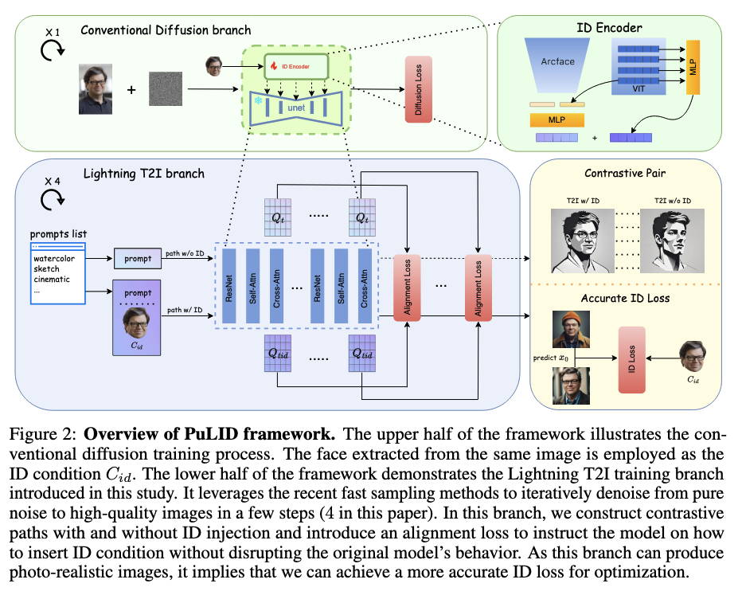

---
{
  "title": "PuLID: Pure and Lightning ID Customization via Contrastive Alignment",
  "paper": "https://arxiv.org/abs/2404.16022",
  "authors": ["Zinan Guo", "Yanze Wu", "Zhuowei Chen", "Lang Chen", "Peng Zhang", "Qian He"],
  "code": "https://github.com/ToTheBeginning/PuLID",
  "openreview": "https://openreview.net/forum?id=E6ZodZu",
  "date": "2025-08-02",
  "tags": ["deep-learning", "computer-vision", "diffusion"]
}
---

- proposes a novel tuning-free method for ID customization for T2I diffusion models
- image elements (e.g. background, lighting, composition, and style) are kept as consistent as possible
- two approaches to achieving ID customization:
  - finetuning based: requires 10s of minutes and economically expensive
  - pretrained adapter: requires expansive portrait dataset to train encoder
- training:
  - introduce "Lightning T2I branch" alongside normal denoising branch
  - minimizes the influence on original model's behaviour by constructing contrastive pair with same prompt and initial latent, with and without ID insertion
  - features between contrastive pair aligned semantically, instructing ID adapter how to insert ID info without affecting behaviour or original model
  - high quality $x_0$ after ID insertion used to extract face embedding and calculate accurate ID loss with the ground truth face embedding

Quantitative metrics (from OpenReview [comment](https://openreview.net/forum?id=E6ZodZu0HQ&noteId=wNWF19Gi9B)):

```
Speed↑	FGIS↑	FID↓	Face Div.↑
PhotoMaker	8.69iter/s	0.596	147.62	0.531
IPAdapter	6.08iter/s	0.571	139.33	0.536
InstantID	4.66iter/s	0.592	152.28	0.502
PuLID	5.85iter/s	0.619	89.80	0.527
```

Method:
- ID customization for T2I diffusion adds $C_id$ as an additional condition working together with the prompt to control image generation. Typically for tuning free customization, ID features are extracted by employing an encoder (typically a frozen backbone like CLIP image encoder or face recognition backbone along with learnable head). To embed the ID features into pre-trained T2I model, parallel cross-attention layers are used in addition to original ones (say, for text conditioning).
- employs a MLP to map features from last layer of CLIP image encoder and [face recognition model](https://arxiv.org/abs/1801.07698) to 5 tokens ("global ID features"). Following [ELITE's](https://arxiv.org/abs/2302.13848) approach, multi-layer features of CLIP mapped to another 5 tokens ("local ID features").



Extra reading:
- line of work based on finetuning:
  - Rinon Gal, Yuval Alaluf, Yuval Atzmon, Or Patashnik, Amit H Bermano, Gal Chechik, and Daniel Cohen-Or. An image is worth one word: Personalizing text-to-image generation using textual inversion. In ICLR, 2023.
  - Nataniel Ruiz, Yuanzhen Li, Varun Jampani, Yael Pritch, Michael Rubinstein, and Kfir Aberman. Dreambooth: Fine tuning text-to-image diffusion models for subject-driven generation. In CVPR, 2023.
  - Edward J Hu, Yelong Shen, Phillip Wallis, Zeyuan Allen-Zhu, Yuanzhi Li, Shean Wang, Lu Wang, and Weizhu Chen. Lora: Low-rank adaptation of large language models. In ICLR, 2022.
  - Nupur Kumari, Bingliang Zhang, Richard Zhang, Eli Shechtman, and Jun-Yan Zhu. Multiconcept customization of text-to-image diffusion. In CVPR, 2023.
- line of work based on pre-training an adapter:
  - Guangxuan Xiao, Tianwei Yin, William T Freeman, Frédo Durand, and Song Han. Fastcomposer: Tuning-free multi-subject image generation with localized attention. IJCV, 2024.
  - Hu Ye, Jun Zhang, Sibo Liu, Xiao Han, and Wei Yang. Ip-adapter: Text compatible image prompt adapter for text-to-image diffusion models. arXiv:2308.06721, 2023.
  - Li Chen, Mengyi Zhao, Yiheng Liu, Mingxu Ding, Yangyang Song, Shizun Wang, Xu Wang, Hao Yang, Jing Liu, Kang Du, et al. Photoverse: Tuning-free image customization with text-to-image diffusion models. arXiv:2309.05793, 2023.
  - Dani Valevski, Danny Lumen, Yossi Matias, and Yaniv Leviathan. Face0: Instantaneously conditioning a text-to-image model on a face. In SIGGRAPH Asia, 2023.
  - Zhen Li, Mingdeng Cao, Xintao Wang, Zhongang Qi, Ming-Ming Cheng, and Ying Shan. Photomaker: Customizing realistic human photos via stacked id embedding. In CVPR, 2024.
  - Xiaoming Li, Xinyu Hou, and Chen Change Loy. When stylegan meets stable diffusion: a w plus adapter for personalized image generation. In CVPR, 2024.
  - Qixun Wang, Xu Bai, Haofan Wang, Zekui Qin, and Anthony Chen. Instantid: Zero-shot identity-preserving generation in seconds. arXiv:2401.07519, 2024.
