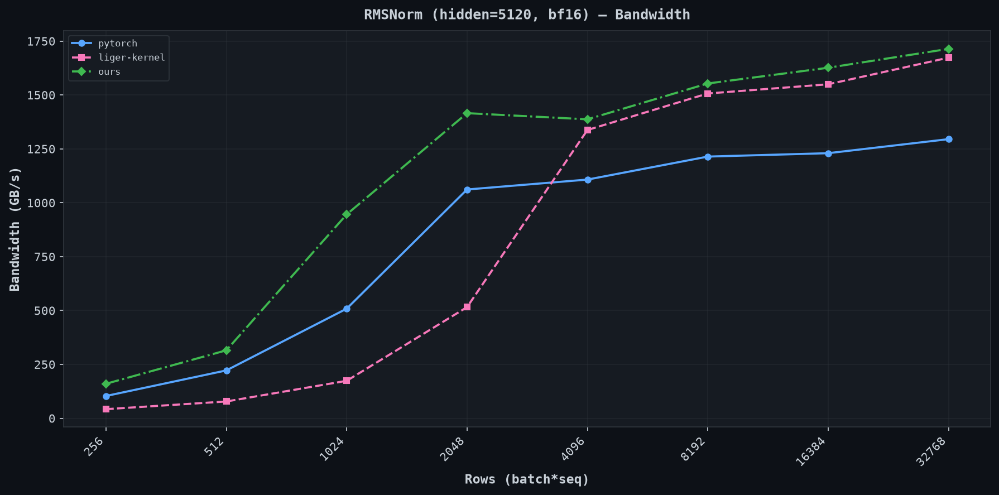
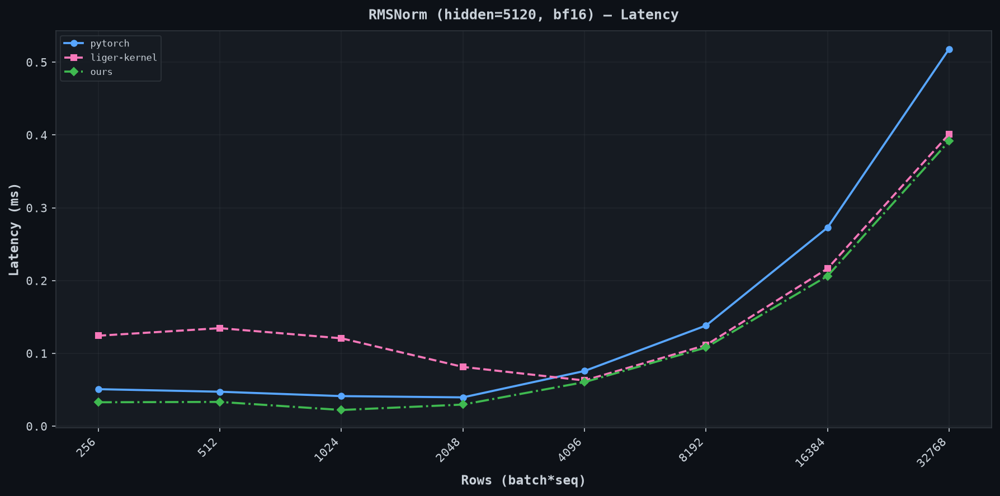
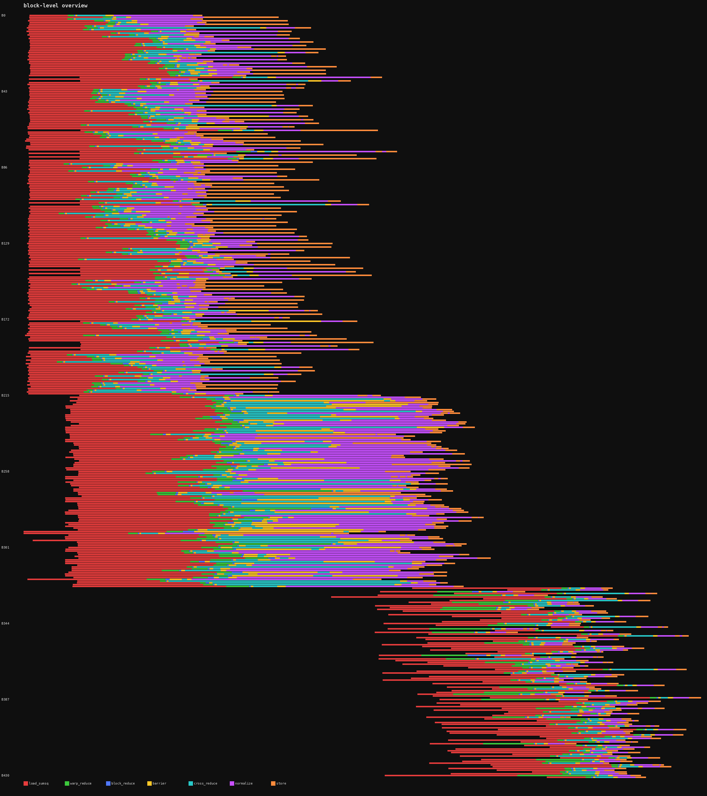
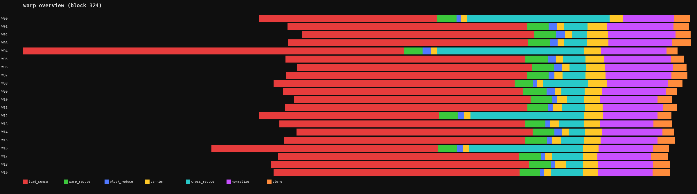

---
{
  "title": "Looking inside your kernels",
  "code": "https://github.com/a-r-r-o-w/a-r-r-o-w.github.io/tree/main/src/blog/3_blossom/00005_looking_inside_your_kernels",
  "date": "2026-07-05",
  "tags": ["cuda", "profiling", "gpu", "mlsys"]
}
---

Interest in writing specialized high performance programs for GPUs and other accelerators has been on the rise in the past few years. There are many resources for doing so today, but not as much on how to look inside these programs and visually dissect them.

Let's say you have a kernel and you want to make it faster: you run Nsight, look at the roofline plots, do calculations on what the bottlenecks are, and guess what the profiler is trying to tell you. The problem with this is that these tools treat your kernel as a black box. What happens inside the kernel is opaque to them aside from certain specifics. You get aggregate metrics (bandwidth utilization, warp occupancy, instruction mix, ...) but no visibility into the *internal* structure of execution.

Which warps are blocked at a barrier? How long does the reduction actually take? Is the load latency hidden effectively? It can tell you when a kernel started and stopped, bytes that were moved, instructions that were executed, time spent per instruction, and lots more helpful information, but it cannot observe internal control flow. 

This matters most for:
- Multi-phase kernels: where you need to know which phase is a potential bottleneck (attention, fused MLP, etc.)
- Pipelined kernels: where producer/consumer stalls are invisible to external metrics
- Warp-specialized kernels: where different warps do different work (e.g., Hopper's TMA warp + compute warp pattern) and you need to see if one is starving the other

Here, we look at a lightweight technique for answering some of these questions. We take RMSNorm as our example kernel and apply *intra-kernel profiling* to record timestamps inside the kernel at different logical phase boundaries.

Access the full code [here](https://github.com/a-r-r-o-w/a-r-r-o-w.github.io/tree/main/src/blog/3_blossom/00005_looking_inside_your_kernels).

> [!NOTE]
> All benchmarks were done on a single A100 80GB SXM4. [Verda](https://verda.com/) provided the compute resources for this. I'm not affiliated with them in any way but, in my experience, they are one of the best platforms for low-level optimization work and I've had a wonderful time working with them. Check them out!

## Table of contents

- [RMSNorm](#rmsnorm)
- [Benchmarks](#benchmarks)
- [Adding instrumentation](#adding-instrumentation)
- [Trace output](#trace-output)
- [Comparison with other approaches](#comparison-with-other-approaches)
- [Additional reading](#additional-reading)
- [Citation](#citation)

## RMSNorm

[RMSNorm](https://arxiv.org/abs/1910.07467) is used in most modern transformer architectures. Given an input vector $x$ and a learned scale $\gamma$, it computes:

$$\text{RMSNorm}(x) = \frac{x}{\sqrt{\frac{1}{n}\sum x_i^2 + \epsilon}} \cdot \gamma$$

A naive implementation requires two passes over data:
- compute sum of squares
- apply the normalization elementwise scaling

Two passes require two global memory reads, which is extremely expensive. Practically, only a single pass is done by keeping data in registers between the two passes (if possible, i.e. when the sum reduction dimension is small enough). In our implementation, similar to most standard implementations, each thread handles exactly one 128-bit vector (8 bf16 values). For `hidden_dim=5120` this means 640 threads (20 warps) per block, well within the A100's register file capacity.

<details>
<summary>Core implementation (bf16 input/output, fp32 accumulation)</summary>

```cpp
// cache-streaming store that bypasses L1/L2 on writes to avoid polluting cache
__device__ __forceinline__ void store_cs_128(void* addr, float4 val) {
  asm volatile(
    "st.global.cs.v4.b32 [%0], {%1, %2, %3, %4};" :: "l"(addr), "r"(__float_as_int(val.x)), "r"(__float_as_int(val.y)), "r"(__float_as_int(val.z)), "r"(__float_as_int(val.w))
  );
}

template<bool T, int NWARPS>
__global__ void rmsnorm_fwd(
  const bf16 * __restrict__ input,
  const bf16 * __restrict__ weight,
  bf16 * __restrict__ output,
  u32 hidden_dim,
  f32 epsilon,
  RawEvent* __restrict__ trace_buf,
  u32* __restrict__ trace_counts
) {
  const u32 row = blockIdx.x;
  const u32 tid = threadIdx.x;
  const u32 lane = tid & 31;
  const u32 warp = tid >> 5;
  const u32 vec_dim = hidden_dim >> 3;

  const bf16 *x = input + (u64)row * hidden_dim;
  bf16 *out = output + (u64)row * hidden_dim;

  // phase 1: load into registers + accumulate sum of squares
  f32 local_vals[8];
  f32 sum_sq = 0.0f;

  if (tid < vec_dim) {
    float4 v = *reinterpret_cast<const float4 *>(x + tid * 8);
    const bf16 *vals = reinterpret_cast<const bf16 *>(&v);
    #pragma unroll
    for (int j = 0; j < 8; j++) {
      local_vals[j] = __bfloat162float(vals[j]);
      sum_sq += local_vals[j] * local_vals[j];
    }
  }

  // shared memory block reduction
  for (int offset = 16; offset > 0; offset >>= 1) {
    sum_sq += __shfl_xor_sync(0xffffffff, sum_sq, offset);
  }

  __shared__ f32 warp_sums[32];
  if (lane == 0) warp_sums[warp] = sum_sq;
  __syncthreads();

  // ...
  // ... warp 0 reduces, broadcasts via warp_sums[0] ...
  // ...
  __syncthreads();

  // phase 2: normalize
  if (tid < vec_dim) {
    f32 inv_rms = rsqrtf(warp_sums[0] / f32(hidden_dim) + epsilon);
    float4 wv = *reinterpret_cast<const float4 *>(weight + tid * 8);
    const bf16 *wvals = reinterpret_cast<const bf16 *>(&wv);

    bf16 result[8];
    #pragma unroll
    for (int j = 0; j < 8; j++) {
      result[j] = __float2bfloat16(local_vals[j] * inv_rms * __bfloat162float(wvals[j]));
    }
    store_cs_128(out + tid * 8, *reinterpret_cast<float4 *>(result));
  }
}
```
</details>

In this kernel:
- each thread loads 128-bits (8 bf16 values; max supported on A100) into registers, computes sum-of-squares, and then normalizes. The input tensor is read from global memory exactly once.
- cache streaming stores to avoid lingering in the L1/L2 cache with data that won't be read again soon (to those familiar with Triton, this is the evict-first policy).
- warp shuffle reduction is used to reduce the sum-of-squares within each warp. These results are written to shared memory, and then warp 0 does a final shuffle reduction (as it now has the full sum-of-squares for the block via shared memory).

## Benchmarks

We compare against two implementations:
- **pytorch**: `torch.nn.functional.rms_norm` (dispatches to [`layer_norm_kernel.cu`](https://github.com/pytorch/pytorch/blob/main/aten/src/ATen/native/cuda/layer_norm_kernel.cu) with `rms_norm=true`)
- **liger-kernel**: the [Liger Kernel](https://github.com/linkedin/Liger-Kernel) Triton implementation

Benchmarking is done with [this](https://github.com/a-r-r-o-w/a-r-r-o-w.github.io/tree/main/src/blog/3_blossom/00005_looking_inside_your_kernels/bench.py) code.

| rows | pytorch (GB/s) | liger-kernel (GB/s) | ours (GB/s) |
|------|---------------|---------------------|-------------|
| 256 | 103 | 42 | 160 |
| 512 | 222 | 78 | 315 |
| 1024 | 509 | 174 | 946 |
| 2048 | 1062 | 516 | 1416 |
| 4096 | 1108 | 1338 | 1387 |
| 8192 | 1214 | 1507 | 1554 |
| 16384 | 1230 | 1550 | 1627 |
| 32768 | 1295 | 1673 | 1714 |





## Adding instrumentation

A template parameter `T` controls tracing. When `T=false`, the compiler eliminates all tracing code (binary identical to the un-instrumented kernel). When `T=true`, lane 0 of each warp records timestamps.

```cpp
struct alignas(8) RawEvent {
  uint64_t clock;
  uint32_t meta;
};

__device__ __forceinline__ uint64_t globaltimer_ns() {
  uint64_t t;
  asm volatile("mov.u64 %0, %%globaltimer;" : "=l"(t));
  return t;
}

__device__ __forceinline__ uint64_t clk() {
  uint64_t t;
  asm volatile("mov.u64 %0, %%clock64;" : "=l"(t));
  return t;
}

#define MARK() do { if (__builtin_expect(do_trace, 0)) { my_smem[ei++] = {clk(), ei}; } } while(0)
```

Two timers are used together. `%globaltimer` is a system-wide nanosecond counter, read once per block to anchor it on a global time axis. `%clock64` is per-SM with cycle resolution (~0.7ns/tick), used for all individual phase marks. Thread 0 writes both to shared memory before any work begins so all warps share the same reference.

A single `MARK()` is placed at each phase boundary. The span between consecutive marks is the phase. A `__syncwarp()` precedes each mark so that pending loads/stores retire before the timestamp is read.

Events are buffered in shared memory and flushed to global memory once at kernel end. Only lane 0 of each warp writes to its own region, so there are no bank conflicts.

The eight phases we measure between marks are:

| phase | what it captures |
|-------|-----------------|
| `load_sumsq` | 128-bit vectorized load from DRAM + fp32 sum-of-squares |
| `warp_reduce` | warp-level shuffle reduction (5 iterations of `__shfl_xor_sync`) |
| `block_reduce` | write partial sum to shared memory |
| `barrier` | first `__syncthreads()` |
| `cross_reduce` | warp 0 reads all partial sums from shared memory + final shuffle |
| `barrier` | second `__syncthreads()` |
| `normalize` | load weight vector from DRAM + rsqrt + elementwise multiply |
| `store` | cache-streaming 128-bit store to global memory |

The instrumented code can be found [here](https://github.com/a-r-r-o-w/a-r-r-o-w.github.io/tree/main/src/blog/3_blossom/00005_looking_inside_your_kernels/rmsnorm_trace.cu).

## Trace output

We run the instrumented kernel on a 432x5120 bf16 tensor (432 blocks, 20 warps per block). A few warmup iterations populate TLBs, then we flush L2 so the traced run hits DRAM on every load (otherwise the trace grossly understates memory latency because of L2 hits). Timestamps are dumped as a binary file and parsed by a [rendering script](https://github.com/a-r-r-o-w/a-r-r-o-w.github.io/tree/main/src/blog/3_blossom/00005_looking_inside_your_kernels/render_trace.py).

Block-level overview (all 432 blocks on a global time axis):



This kernel uses 32 registers/thread and 640 threads/block, so the A100 fits 3 blocks/SM (65536 / (32 × 640) = 3). With 108 SMs, that is 324 concurrent blocks. 432 blocks means one full wave of 324 and a partial second wave of 108. You can see the second wave start shifted to the right as SMs become free.

Per-warp timeline for block 324 (first block of the second wave):



This tells us several things immediately:
- **Load** (red) dominates. DRAM latency is high per 128-bit read.
- **Warp reduce** (green) is a thin sliver. 5 shuffles take negligible time.
- **Normalize** (purple) is the second largest phase because it reads the weight vector from DRAM (another cold 128-bit load) plus the rsqrt + multiply.
- **Store** (orange) is fast. Cache-streaming writes are fire-and-forget.
- **Barriers** (yellow) show synchronization cost. Warps that finish loading early wait for slower warps.

### Design choices and tradeoffs

**Hybrid timer.** `clock64` has cycle resolution but is per-SM (can't compare across blocks). `globaltimer` is global but only ~1024ns resolution on A100. We read `globaltimer` once per block as an anchor, then use `clock64` for everything else.

**Shared memory buffering.** Global stores take 200+ cycles each. We buffer all timestamps in shared memory (~5 cycles/write) and flush once at kernel end.

**`__syncwarp()` before marks.** The GPU can execute `clock64` while loads or other ops are still in flight. Without this, latency may be misattributed.

## Comparison with other approaches

Each approach makes different architectural decisions. Let me walk through another interesting one in detail.

### Triton Proton

Proton implements profiling as an MLIR dialect integrated into Triton's compilation pipeline. The user annotates scopes in their Triton kernel:

```python
import triton.profiler.language as pl

with pl.scope("load_and_add"):
    x = tl.load(ptr)
    y = x + 1
```

The compiler lowers these annotations through three stages:
1. **`proton.record` ops** in Triton IR lowered to `ScopeIdAllocation` assigns numeric IDs and validates nesting ([`Dialect/lib/Analysis/ScopeIdAllocation.cpp`](https://github.com/triton-lang/triton/blob/main/third_party/proton/Dialect/lib/Analysis/ScopeIdAllocation.cpp))
2. **`ProtonToProtonGPU` pass** replaces records with `read_counter` + `circular_store` ops, allocates shared memory buffers, and inserts finalization logic ([`Dialect/lib/ProtonToProtonGPU/ProtonToProtonGPUPass.cpp`](https://github.com/triton-lang/triton/blob/main/third_party/proton/Dialect/lib/ProtonToProtonGPU/ProtonToProtonGPUPass.cpp))
3. **`ProtonGPUToLLVM` pass** lowers to PTX. `mov.u32 %clock` for timestamps, `st.global.cg.v2.b32` for vectorized 64-bit stores ([`Dialect/lib/ProtonGPUToLLVM/ProtonNvidiaGPUToLLVM/NvidiaPatternProtonGPUOpToLLVM.cpp`](https://github.com/triton-lang/triton/blob/main/third_party/proton/Dialect/lib/ProtonGPUToLLVM/ProtonNvidiaGPUToLLVM/NvidiaPatternProtonGPUOpToLLVM.cpp))

The differences from our simpler approach are:
- **Circular buffer in shared memory.** Events go to shared memory, flushed to global at kernel end via `FinalizeOp`. Buffer wraps circularly and drops oldest on overflow. ([intra-kernel docs](https://github.com/triton-lang/triton/blob/main/third_party/proton/docs/intra-kernel.md), [`ProtonGPUOps.td`](https://github.com/triton-lang/triton/blob/main/third_party/proton/Dialect/include/Dialect/ProtonGPU/IR/ProtonGPUOps.td), encoding in [`Utility.cpp`](https://github.com/triton-lang/triton/blob/main/third_party/proton/Dialect/lib/ProtonGPUToLLVM/Utility.cpp))
- **Selective warp sampling.** Profile a subset of warps only (`sampling_strategy="selective"`, `sampling_options="0, 2, 7"`). Better for when you just want a few representative samples.
- **Overhead correction.** Subtracts a fixed per-scope cost (7 cycles NVIDIA, 36 AMD) from each interval to account for the clock read itself. ([`CircularLayoutParser.cpp`](https://github.com/triton-lang/triton/blob/main/third_party/proton/common/lib/TraceDataIO/CircularLayoutParser.cpp))

There is also a TTGIR override workflow: dump the compiled IR, manually insert `proton.record start/end "scope"` at exact instruction boundaries, and re-run with `TRITON_KERNEL_OVERRIDE=1`. This gives precise control without touching the Python source.

## Additional reading

- [Triton Proton intra-kernel docs](https://github.com/triton-lang/triton/blob/main/third_party/proton/docs/intra-kernel.md)
- [Triton Proton MLIR dialect source](https://github.com/triton-lang/triton/tree/main/third_party/proton/Dialect)
- [Triton Proton CircularLayoutParser](https://github.com/triton-lang/triton/blob/main/third_party/proton/common/lib/TraceDataIO/CircularLayoutParser.cpp)
- [NVIDIA CUPTI documentation](https://docs.nvidia.com/cupti/index.html)
- [NVIDIA Nsight Compute documentation](https://docs.nvidia.com/nsight-compute/index.html)
- [PTX ISA special registers](https://docs.nvidia.com/cuda/parallel-thread-execution/index.html#special-registers)

## Citation

If you find this useful in your research, please consider citing:

```
@article{avs2026lookinginsideyourkernels,
  author = {Aryan V S},
  title = {Looking inside your kernels},
  year = {2026},
  url = {https://a-r-r-o-w.github.io/blog/3_blossom/00005_looking_inside_your_kernels}
}
```
